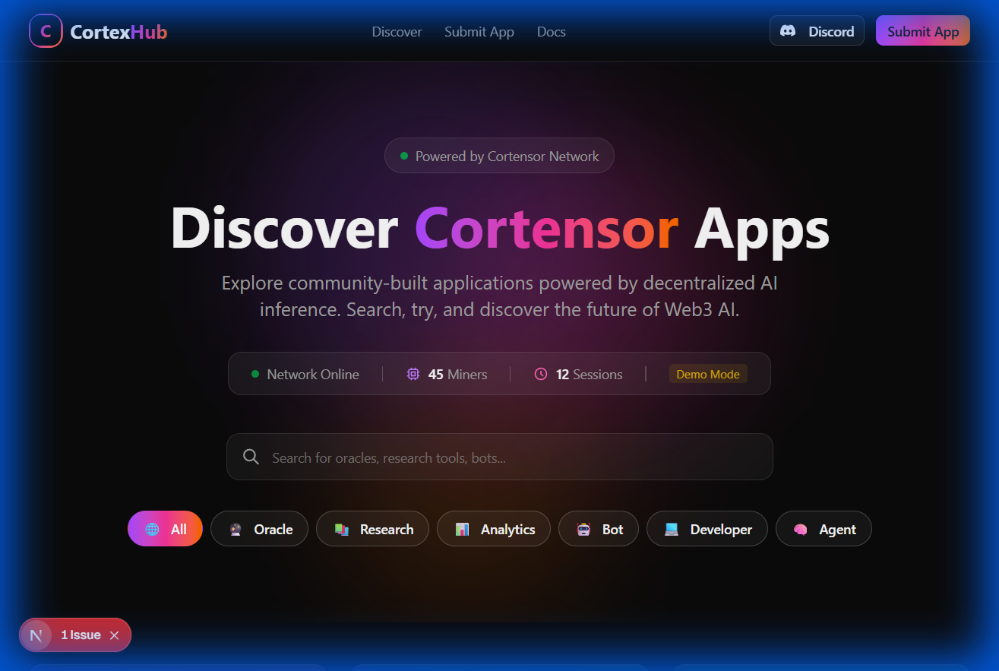
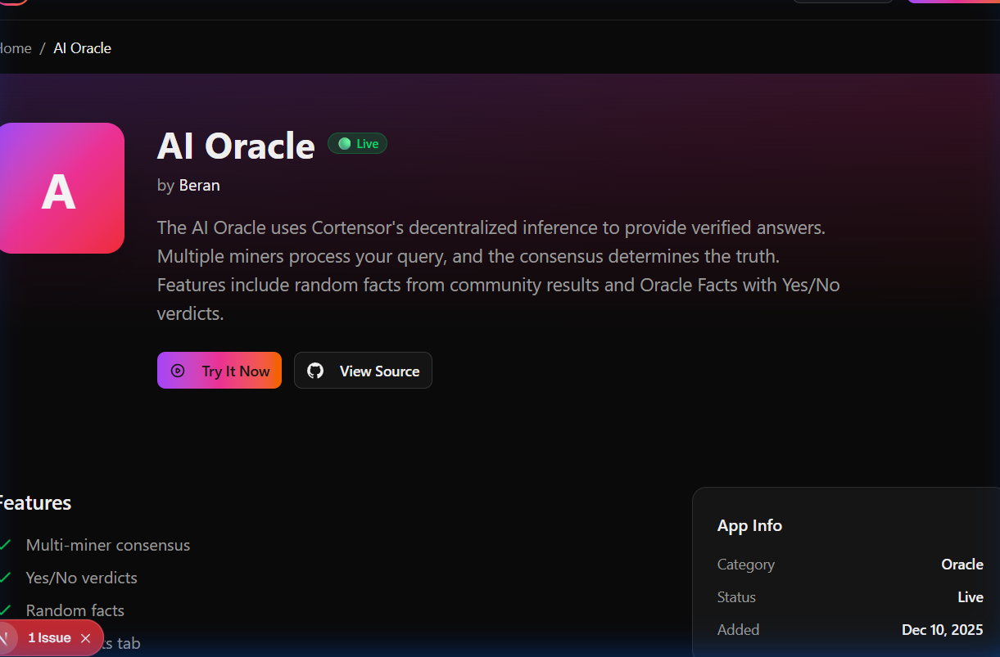
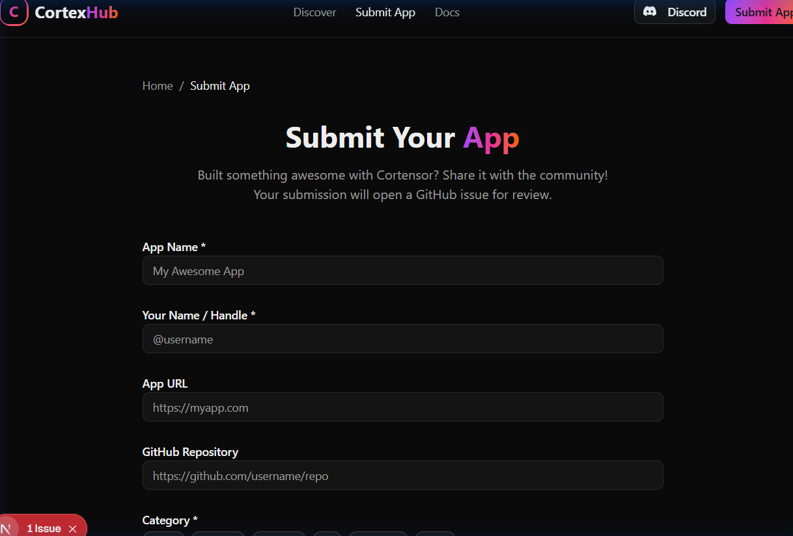

# CortexHub 🌐

> **App Store & Catalog for Cortensor-powered applications**
+
## 🎯 What is CortexHub?

CortexHub is a discovery platform for Cortensor-powered applications. It helps users find, explore, and try community-built apps that leverage Cortensor's decentralized AI inference network.

**Hackathon Track:** App Stores & Catalogs 2.0

## ✨ Features

- 🔍 **Search & Discovery** - Find apps by name, description, or tags
- 🏷️ **Category Filters** - Browse by Oracle, Research, Analytics, Bot, Developer, Agent
- 📊 **Live Network Stats** - Real-time miner and session counts from Cortensor
- 🚀 **Try Now** - One-click access to live apps
- 📝 **Submit Apps** - Easy submission via GitHub issues

## 🖼️ Screenshots

<table>
  <tr>
    <td></td>
    <td></td>
    <td></td>
  </tr>
  <tr>
    <td align="center">App Catalog</td>
    <td align="center">App Details</td>
    <td align="center">Submit Form</td>
  </tr>
</table>

## 🏗️ Architecture

```
┌─────────────────────────────────────────────────────────┐
│                   CortexHub (Next.js 14)                │
├─────────────────────────────────────────────────────────┤
│  Pages: Home | App Detail | Submit                      │
├─────────────────────────────────────────────────────────┤
│  Components: Header | AppCard | SearchBar | FilterTags  │
│              NetworkStats | AppGrid                     │
├─────────────────────────────────────────────────────────┤
│  Data: apps.json | lib/cortensor.ts (API Client)        │
└───────────────────────────┬─────────────────────────────┘
                            │
                            ▼
              ┌───────────────────────────────┐
              │     Cortensor Router API      │
              │  GET /api/v1/status           │
              │  GET /api/v1/miners           │
              │  GET /api/v1/sessions         │
              │  POST /api/v1/completions     │
              └───────────────────────────────┘
```

## 🛠️ Tech Stack

- **Framework:** Next.js 14 (App Router)
- **Styling:** Tailwind CSS
- **Components:** shadcn/ui
- **Language:** TypeScript
- **API:** Cortensor Router v1

## 🚀 Quick Start

```bash
# Clone the repo
git clone https://github.com/himanshu-sugha/cortexhub.git
cd cortexhub

# Install dependencies
npm install

# Set up environment (optional - works in demo mode)
cp .env.example .env.local
# Edit .env.local with your Cortensor API key

# Run development server
npm run dev
```

Open [http://localhost:3000](http://localhost:3000)

## 📡 Cortensor Integration

CortexHub integrates with Cortensor's Router API to:

1. **Display Network Stats** - Shows live miner/session counts
2. **Fallback to Demo Mode** - Works without API access for demos

```typescript
// lib/cortensor.ts - API Client
export async function getNetworkStats() {
  const [status, miners, sessions] = await Promise.all([
    fetch(`${ROUTER_URL}/api/v1/status`),
    fetch(`${ROUTER_URL}/api/v1/miners`),
    fetch(`${ROUTER_URL}/api/v1/sessions`)
  ]);
  return { minerCount, sessionCount, isOnline };
}
```

## 📂 Project Structure

```
cortexhub/
├── src/
│   ├── app/
│   │   ├── page.tsx           # Home (catalog)
│   │   ├── app/[id]/page.tsx  # App detail
│   │   └── submit/page.tsx    # Submit form
│   ├── components/
│   │   ├── Header.tsx
│   │   ├── AppCard.tsx
│   │   ├── SearchBar.tsx
│   │   ├── FilterTags.tsx
│   │   └── NetworkStats.tsx
│   ├── data/
│   │   └── apps.json          # App registry
│   ├── lib/
│   │   └── cortensor.ts       # API client
│   └── types/
│       └── index.ts
└── public/
    └── screenshots/
```

## 🏆 Hackathon Scoring

| Criteria | Implementation |
|----------|---------------|
| **Functionality (25%)** | Full working catalog with search, filters, detail pages |
| **Cortensor Integration (25%)** | Network stats API, demo mode fallback |
| **Originality (20%)** | First app store for Cortensor ecosystem |
| **Usability (20%)** | Premium dark UI, responsive design |
| **Public Good (10%)** | Free, open source, helps community |

## 📜 License

MIT License - see [LICENSE](LICENSE) file

## 🔗 Links

- [Cortensor Docs](https://docs.cortensor.network)
- [Hackathon #3](https://docs.cortensor.network/community-and-ecosystem/hackathon/hackathon-3)
- [Discord](https://discord.gg/cortensor)

---

Built with ❤️ for Cortensor Hackathon #3
